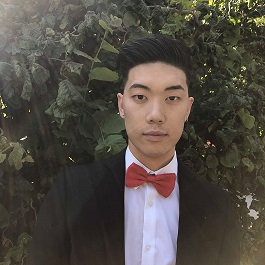

**Hello there!** 

My name is Vandy Liu (he/him), and I'm a computer science student at UBC graduating in Spring 2022.

During the school year, I am a teaching assistant for CPSC 121, a first year computer science course.
In the summer of 2019, I was an AFE SDE Intern at Amazon Vancouver on the Step Functions team. I mainly worked on an internal developer tool.
In the fall of 2019, I worked at Splunk Vancouver as a full stack developer intern on the Machine Learning team. In the winter of 2020, I was a software engineer intern in the Microsoft Garage Program in Vancouver working on the [Device Simulator Express](https://aka.ms/getDSX). In the summer of 2020, I returned to Splunk Vancouver on the Machine Learning team where I worked on the Splunk Machine Learning Experimentation platform.

Outside of school, I like to watch the NFL, NBA (Go raptors!), play video games and play soccer. Currently, I am playing Fortnite and a little bit of CS:GO.

