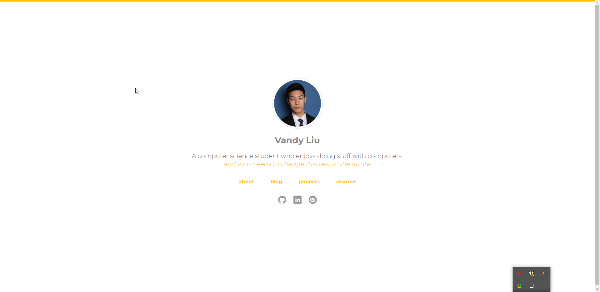
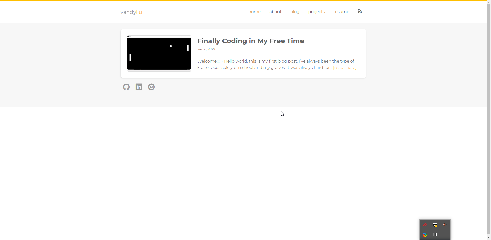

+++
title = "A website up"
description = "Creating my own personal website"
date = "2019-01-26"
keywords = ["blog", "project"]
categories = ["blog", "project"]
tags = [
 "blog",
 "coding",
 "project"
]
series = []
aliases = []
image = "chrome_2019-01-26_19-09-13.png"

+++

For the past three months, I've been trying to make a website with Jekyll by taking [this repository](https://github.com/nandomoreirame/end2end) and making it my own. Unluckily for me, it never worked out. Unfortunately, I don't have enough knowledge about Ruby or Jekyll to figure out how to solve the issues I was having even though the webpage loaded well locally.

Because of my stubbornness, I never wanted to give up on it but I think it is finally the time. I want to work on other stuff so I'm just going to work with the default jekyll theme for now and although it is not as aesthetic, it should get the job done.

I don't want my small edits of the website to get unnoticed though so here are some pictures of what this website was supposed to look like!

If anyone knows how to solve the problem, here is the [repository link](https://github.com/vandyliu/broken-jekyll-website). I would still love to get it up and running!

Update (Jan 10, 2021):
New website now ahahahah. Old one can be found on GitHub somewhere.