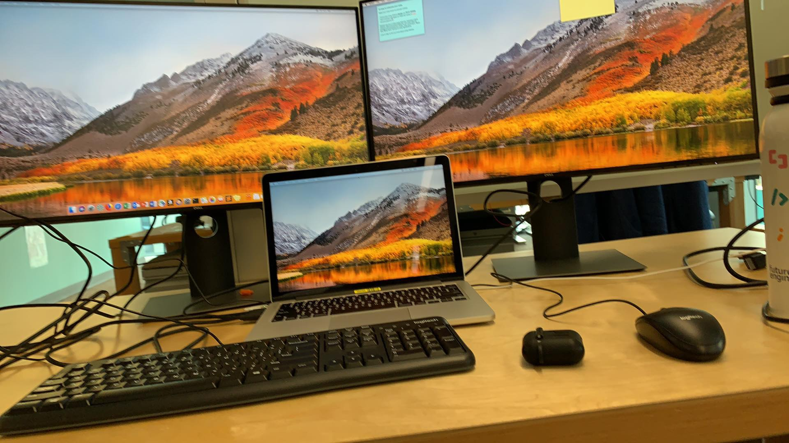

+++
title = "Big update"
description = "I got my first internship and it's at Amazon!"
date = "2019-06-20"
keywords = ["blog", "internship", "amazon"]
categories = ["blog", "internship"]
tags = [
 "blog",
 "internship"
]
series = []
aliases = []
image = "amazon.jpg"

+++

*My desk*

Hello everyone that reads this! (Probably around **1**)

I know I haven't updated this in a while. I've been pretty busy with school and trying to learn new things. Over second semester, I applied to one summer internship after my friend Josh told me to because there were internships specific for freshmen and sophmores. I googled 'sophmore internships' and found one by Amazon. I applied in February and thought nothing of it. I signed up for summer school already and re-applied to be a summer school TA. In March, I got an email that Amazon wanted to schedule an interview with me and I was stoked!!!!!!!!!!!!!!!! I completely forgot I applied but then I started grinding leetcode.

I think I went through 50 LeetCode questions in about two weeks. I leetcoded almost 6 hours a day during my reading break. The interview process went pretty smooth for me. I think the questions were a lot easier because of the emphasis on younger undergrads. During the time in between, I dabbled in Python and tried to enjoy my free time before I started working full time.

It's been four week since I started and it's been pretty great. I went in knowing so little and I feel like I haven't learned much because there's always so much to learn. There's no doubt that I've learned a lot though. I'm still taking it all in. However, I'm starting to get into the groove of things and starting to have a real impact on our project, which is super exciting. I've been asking a lot of questions and trying to get as much help as possible. Everyone here is so smart and willing to help. I'd love to come back here some day.

Now, I'm looking for Fall internships so I'm hoping that goes well.

Feel free to reach out!