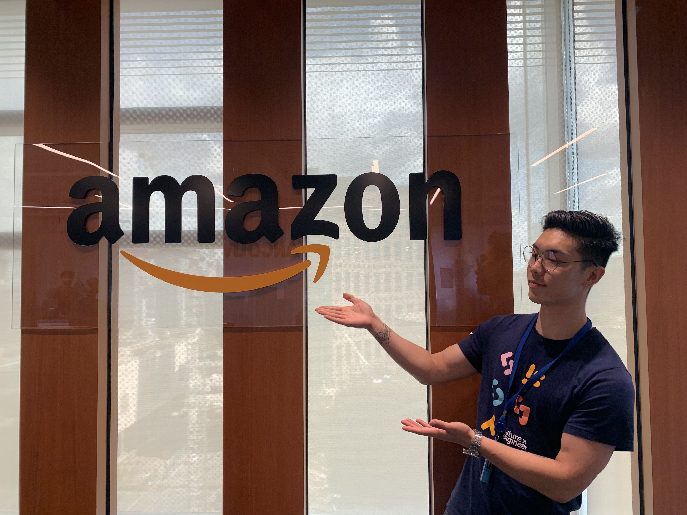
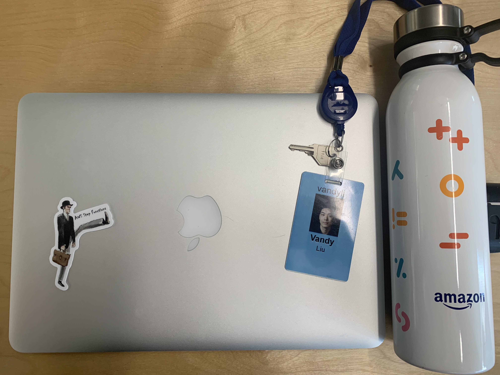
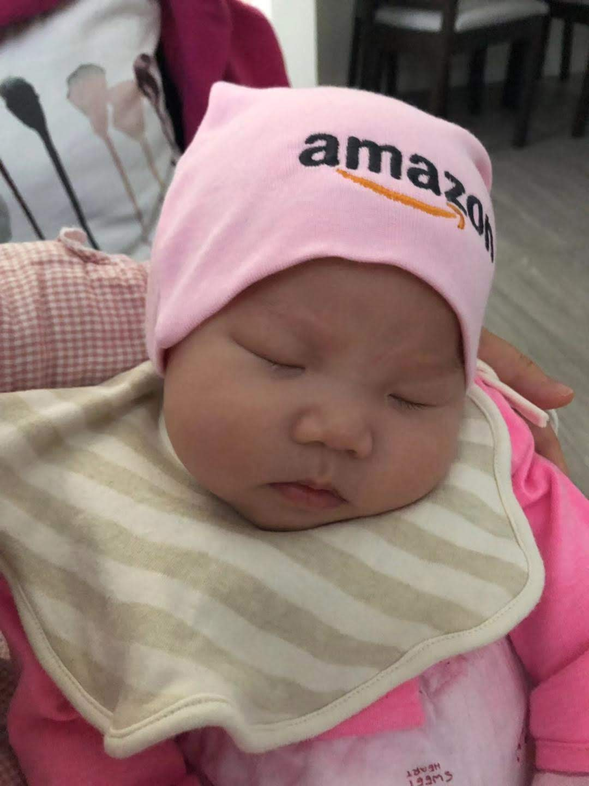

+++
title = "End of Amazon Internship"
description = "How my Amazon internship went"
date = "2019-08-20"
keywords = ["blog", "amazon"]
categories = ["blog", "internship"]
tags = [
 "blog",
 "internship",
 "amazon",
 "java"
]
series = []
aliases = []
image = "amazon2.jpg"

+++

*Amazon Vancouver*

This past week was my last week as an intern at Amazon. It was an incredible experience, where I learned not only a lot about programming and code, but about the deployment cycle, what work is like, and so many more things.

**What I worked on**

Unfortunately, I cannot go into much detail about what I worked on this Summer. I will say that it was an internal developer tool that is frequently used by engineers. I worked with APIs in Java and connecting them to an AngularJS frontend, so it was a good full-stack experience. The other interns mostly worked on internal developer tools that utilized more AWS services like AWS Lambda, Redshift, Cloudwatch, etc so they gained a lot of experience working with those services, while I mostly gained experience with web development. I also worked on automatically resolving some tickets that have been taking up a lot of engineer time.

**Things I learned**
- Programming is not just about coding. There is a lot more to programming like communicating, designing, researching and analyzing
- I spend most of my time at work researching/figuring out how to code stuff and debugging
- how APIs work and how they connect a backend and a frontend
- Got experience with AngularJS and Java full stack development
- Amazon employees really **REALLY** live by the [Leadership Principles](https://www.amazon.jobs/en/principles) so if you ever want to work at Amazon, make sure you embody these and show it off in your interview
- How to use AWS services like Step Functions, SNS and Lambda

**Best moments**
- Playing ping pong at lunch
- Going to Seattle and participating in the internal intern hackathon
- Getting the rare free lunch
- **Finally finishing tasks that gave me so much trouble during the internship**
- Going out with the other amazing interns

I'm incredibly grateful for the opportunity given to me. I learned that I still have a whole lot to learn and I am incredibly excited to take on this challenge. I am also excited to announce I was offered a return offer and am definitely considering going back. I would especially love to go to a new city like Seattle or San Francisco to get a feel of the adult life. I've never been anywhere outside of BC for an extended period.

*My laptop*

**Bonus:** *Cute picture of my niece repping Amazon* :heart_eyes: