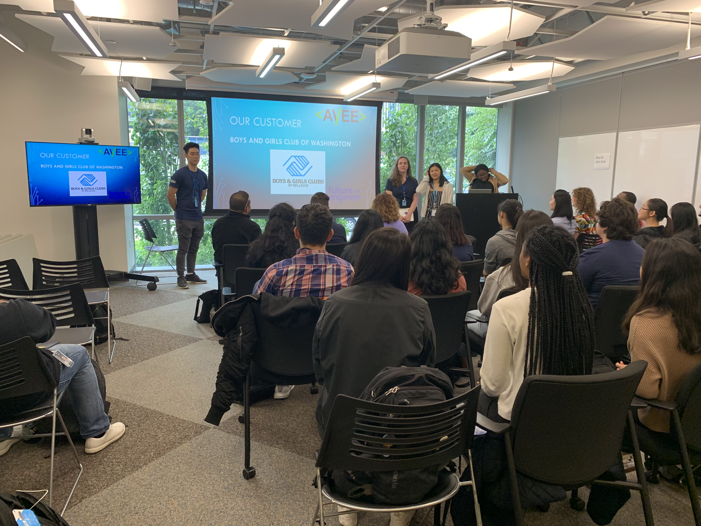
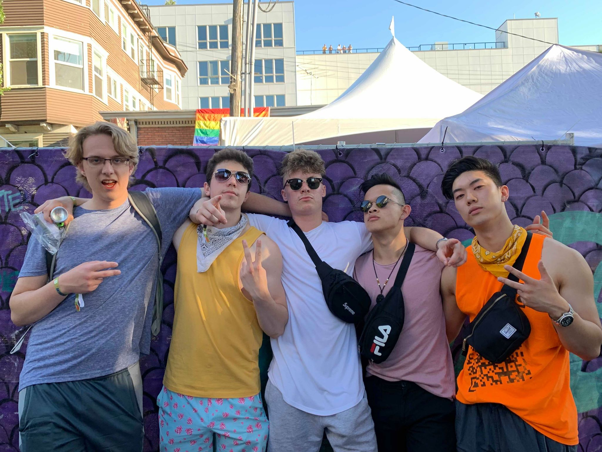

+++
title = "Seattle Trip"
description = "Amazon took the Canadian interns down to Seattle for a few days and this is how it went"
date = "2019-07-22"
keywords = ["blog", "amazon", "internship"]
categories = ["blog", "internship"]
tags = [
 "internship",
 "blog",
 "amazon"
]
series = []
aliases = []
image = "alexademo.jpg"

+++

*Our hackathon presentation*

This past week Amazon flew me and all the other Amazon Future Engineer (AFE) interns out to Seattle for a hackathon and a music festival. This would be the second hackathon I've been to. The first one I did was XD Hacks at UBC. At this hackathon, the challenge was to make an Alexa skill for one of three non-profit organizations. Our team built an Alexa skill for the Boys and Girls Club of Washington. Our skill made it simpler and more efficient to check students out as they left the club. One of the utterances we coded were when a student leaves, that student would tell Alexa that they are going home, how they are going home and with whom they are going home with. The other utterance would be asking if a child left, Alexa would check the database, and then say that the child left or that the child is still there. We used node.js for the "backend" of the Alexa Skill. We hooked it up to a MongoDB database and also created a Web UI that displays all the statuses of the children for a given day. Unfortunately, many teams had similar ideas so it didn't work out so well but I had a lot of fun and learned quite a lot.

Technical stuff aside, Seattle was pretty cool. There were lots of Amazon employees everywhere! Every other street, I would see a blue badge around someone's neck or by someone's waist. The Amazon Go store was also super cool. On the last day of our trip, we went to Pike Place Market. The food was pretty expensive and it was packed so we didn't do much there but hopefully, I'll be back one day and I can really explore the city.

That same day, we also went to Capitol Hill Block Party. It was also very fun but I lost my brand new iPhone XR... ):

Thank you Amazon Future Engineers Program for the amazing trip!!!!

*Not a picture person but this is some of the interns at the festival*