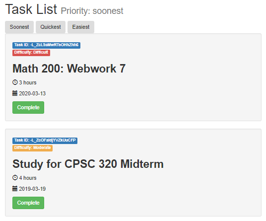
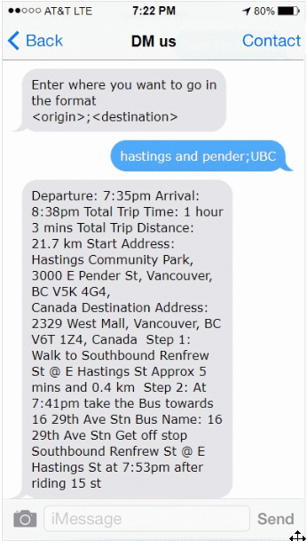
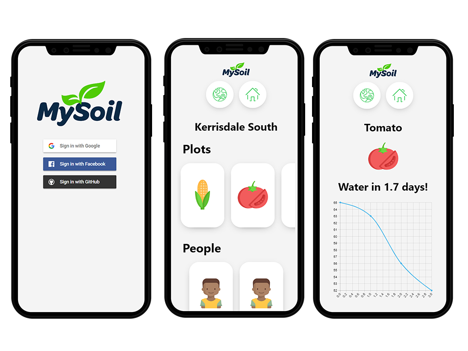
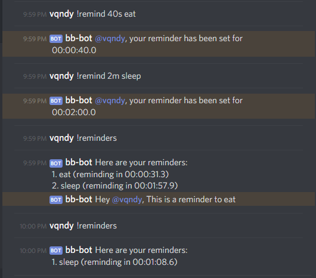

+++
title = "Projects"
date = "2019-03-10"
description = "Here is a list of projects that I worked on"
tags = [
]
+++
More will be added. Just haven't gotten to writing a small write up for quite a few. If you're interested in others, check out my [GitHub](https://github.com/vandyliu)

### [**Box Score Quick**](https://vandyliu.com/boxscorequick)

*Languages/Technologies: React, Python, Flask, MongoDB (previously)*

For NBA fanatics, who want to watch interesting games or just get real-time box scores quick and easy. All box scores for every game all on a single page. Read more [here](../../../blog/2019/09/full-stack-nba-project) and [here for an update](../../../blog/2019/11/updating-my-nba-project).

### [**Priority Task Manager**](https://vandyliu.com/PriorityTaskManager)

*Languages/Technologies: Javascript, Firebase*

Users can log in using their Google ID, and keep track of tasks that they have to complete. Give each task properties such as time it will take, difficulty and due date and sort through your tasks based on the property selected.

### **Direction Message (DM) Us (Hackathon)**

*Languages/Technologies: Python, Flask, Microsoft Azure, Twilio API, Google Maps API*

A Flask app hosted on Azure that communicates through SMS messages to provide users with real-time transit information and directions, which is usually only available with data. Our focus was to help people that cannot afford data get access to transit information because everyone should know how to get home regardless of financial status.

### **Check Out Alexa skill (Hackathon)**

*Languages/Technologies: Node.js, AWS Lambda, MongoDB*

An Alexa skill designed to make keeping track of attedance for after-school programs easier. Parents can quickly check their child out with their voice. The supervisors can also see who is still here and who has left with a web UI designed with React. Read more [here](seattle-trip).

### **MySoil.space (Hackathon)**

*Languages/Technologies: React, Firebase, Microsoft Weather API*

A mobile web application to make community gardening easier. Join a community garden and keep track your crops and plants. Using the Microsoft Weather API and our Arduino sensor that detects soil moisture, an algorithm determines if a plant needs to be watered along with other tasks and reminders.

### **Discord Reminder Bot**

*Languages/Technologies: Node.js*

A simple Discord bot made with the discord.js node module. Use it to remind yourself of things, while you're chilling in Discord or playing video games. Read more [here](../../../blog/2019/01/finally-coding-in-free-time).